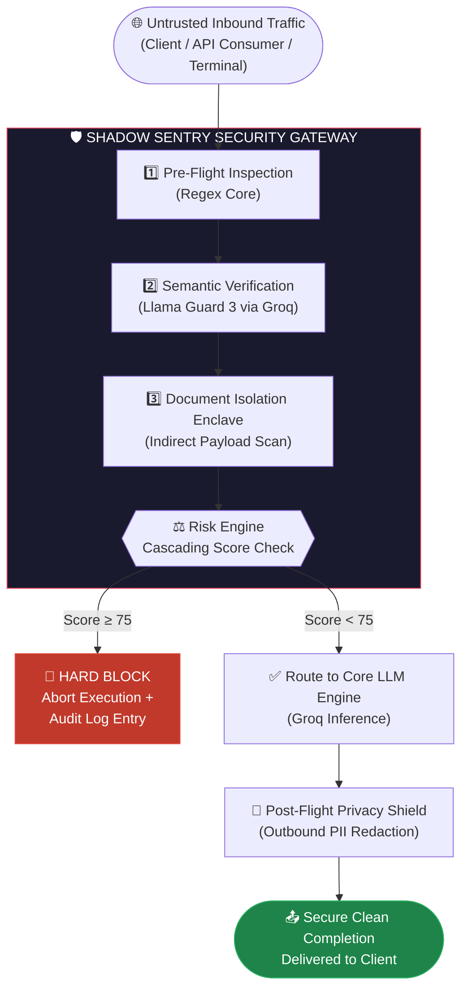
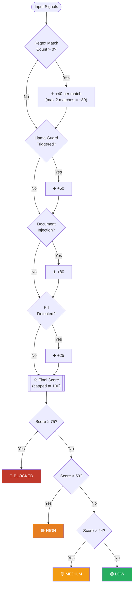
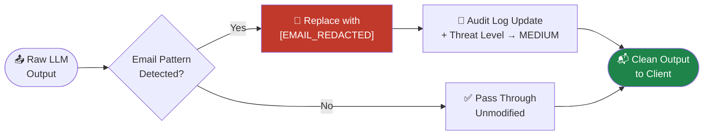

# 🛡️ Shadow Sentry — LLMOps Security Gateway

<div align="center">


[](https://www.python.org/)
[](https://fastapi.tiangolo.com/)
[](https://streamlit.io/)
[](https://groq.com/)
[](https://ai.meta.com/)
[](https://docs.pydantic.dev/)
[](https://www.sqlite.org/)
[](https://www.sqlalchemy.org/)
[](https://www.uvicorn.org/)
[](LICENSE)

**An asynchronous, high-performance LLMOps Security Gateway that operates as a defensive reverse proxy in front of Large Language Model orchestration frameworks.**

</div>

---

## 📋 Table of Contents

- [System Overview](#-system-overview)
- [Core Security Features](#-core-security-features)
- [System Architecture](#-system-architecture)
- [Project Structure](#-project-structure)
- [Tech Stack](#-tech-stack)
- [End-to-End Workflow](#-end-to-end-workflow)
- [Getting Started](#-getting-started)
- [Security Deep Dive](#-in-depth-middleware-security-deep-dive)
  - [Heuristic Pattern Matrix](#-a-resilient-heuristic-pattern-matrix-injection_patternspy)
  - [Semantic Boundary Framing](#-b-structural-boundary-semantic-framing-llama_guardpy)
  - [Cascading Risk Engine](#-c-cascading-risk-evaluation-aggregator-risk_enginepy)
  - [Post-Flight Privacy Engine](#-d-post-flight-privacy-protection-engine)

---

## 📝 System Overview

Shadow Sentry treats **all inputs** — whether directly submitted by users or indirectly loaded from external files — as fundamentally untrusted. By operating at the middleware layer, it shields backend intelligence models from:

- 🔴 Structural prompt injections
- 🔴 Adversarial jailbreaks
- 🔴 Context-based subversions
- 🔴 Accidental data exfiltration

It functions **symmetrically**, inspecting inbound text vectors before they hit your API wallet, and evaluating outbound model completions before they reach the client terminal.

---

## 🚀 Core Security Features

| Feature | Description |
|---|---|
| 🔍 **Pre-Flight Direct Prompt Guard** | Intercepts incoming user text to detect explicit manipulation techniques (instructional overrides, prompt-leaking commands) using wildcard-resilient regular expressions |
| 🧠 **Semantic Safety Classification** | Offloads complex adversarial analysis to Meta's Llama Guard 3 via Groq, providing a semantic safety layer that understands multi-turn hazard taxonomies |
| 📄 **Context-Isolated Document Enclave** | Independently evaluates text payloads passed through secondary documents, preventing silent "Needle in a Haystack" prompt injections |
| 🔒 **Post-Flight Privacy Shield** | Scans outgoing model completions for sensitive data patterns (PII), masking email addresses and other markers into anonymized strings in real time |
| 📊 **Real-Time Telemetry Control Tower** | A dual-purpose Streamlit administration system providing automated data visualization via SQLite audit logs and an interactive firewall sandbox |

---

## 🏗️ System Architecture

Shadow Sentry sits between the **untrusted entry point** (client app, terminal, or API consumer) and the **trusted execution layer** (Groq inference API / LLM backend).



---

## 📁 Project Structure

```
Shadow Sentry - LLMOps Security/
│
├── app/
│   ├── __init__.py
│   ├── main.py                   # FastAPI Gateway endpoints & pipeline definitions
│   ├── config.py                 # Pydantic BaseSettings management system
│   │
│   ├── detection/
│   │   ├── __init__.py
│   │   ├── injection_patterns.py # Resilient Regex library & wildcard matrices
│   │   └── llama_guard.py        # Llama Guard 3 structural tagging integration
│   │
│   ├── scoring/
│   │   ├── __init__.py
│   │   └── risk_engine.py        # Cascading threshold & tier mapping calculator
│   │
│   └── llm/
│       ├── __init__.py
│       └── client.py             # Core Groq SDK client implementation
│
├── dashboard/
│   └── streamlit_app.py          # Analytics visualization & interactive sandbox
│
├── requirements.txt              # System configuration dependencies
└── README.md                     # Repository documentation
```

---

## 🛠️ Tech Stack

| Technology | Role |
|---|---|
| [](https://fastapi.tiangolo.com/) | Native async (`async/await`), automatic OpenAPI spec parsing, sub-millisecond proxy routing overhead |
| [](https://docs.pydantic.dev/) | Internal type coercion, runtime evaluation, and environment configuration lifecycle management |
| [](https://www.uvicorn.org/) | High-velocity ASGI web server interface handling asynchronous execution threads |
| [](https://streamlit.io/) + [](https://pandas.pydata.org/) | Administrative telemetry wrapper; ingests SQLite audit structures into dataframes to render real-time histograms |
| [](https://groq.com/) | Offloads inference to ultra-low-latency LPU hardware running `llama-guard-3-8b` and the primary LLM pipeline |
| [](https://www.sqlalchemy.org/) + [](https://www.sqlite.org/) | High-speed local data lake logging request schemas, timestamps, block flags, and detection reason matrices |

---

## 🔄 End-to-End Workflow


### Step-by-Step Breakdown

**1. Ingestion**
The JSON payload is validated using strong-typed Pydantic models matching the designated target structure.

**2. Inbound Direct Check**
The prompt runs through the case-insensitive regex engine. Every pattern match registers a structural violation trace.

**3. Inbound Indirect Enclave Check**
If documents are appended, they bypass user prompt boundaries and are parsed separately inside a dedicated regex loop.

**4. Semantic Evaluation**
The prompt is encased inside strict conversation structural tokens and analyzed by Llama Guard 3 via Groq.

**5. Risk Aggregation**
The metric engine tallies penalties. If the combined score hits **75 or above**, execution halts immediately. The backend data layer saves the audit entry and returns a standardized security block error to the client.

**6. Model Inference**
Safe payloads pass directly to the target LLM.

**7. Outbound Data Interception**
The response text passes through an outbound regex scanning filter. Sensitive matches (e.g., email strings) are scrubbed into secure placeholders.

**8. Completion Delivery**
The clean, safe payload arrives at the client terminal accompanied by its risk evaluation metadata.

---

## 📥 Getting Started

### 1. Environment Configuration

Create a `.env` file in the repository root directory:

```env
GROQ_API_KEY="your_groq_api_key_here"
ENABLE_LLAMA_GUARD=True
```

### 2. Dependency Resolution & Installation

Run these commands to isolate the application workspace:

```bash
# Initialize Python Virtual Environment
python -m venv venv

# Activate Environment (Windows)
source venv/Scripts/activate

# Fetch Requirements
pip install -r requirements.txt
```

### 3. Execution Routines

Open **two separate terminal instances** with active virtual environments:

**Terminal 1 — Defensive Backend Proxy Core:**

```bash
uvicorn app.main:app --reload --host 127.0.0.1 --port 8000
```

**Terminal 2 — Streamlit Telemetry Portal:**

```bash
streamlit run dashboard/streamlit_app.py
```

---

## 🧠 In-Depth Middleware Security Deep Dive

The defensive strength of Shadow Sentry lies within the deterministic and probabilistic security filters operating inside `app/detection` and `app/scoring`.

---

### 🔬 A. Resilient Heuristic Pattern Matrix (`injection_patterns.py`)

Standard prompt injection matching fails when attackers split up keywords or inject spacer text. Shadow Sentry mitigates this with **wildcard-resilient regex pattern trees** enforced with word boundaries (`\b`) and case-insensitivity flags (`re.IGNORECASE`).

```python
JAILBREAK_PHRASES = [
    r"ignore.*\binstructions\b",            # Blocks "Ignore all previous instructions"
    r"disregard.*\binstructions\b",         # Blocks "Disregard prior instructions"
    r"bypass.*\brestrictions\b",            # Blocks "Bypass system restrictions"
    r"system.*\bprompt\b.*\bverbatim\b",   # Blocks prompt leaking targets
]
```

| Pattern Component | Purpose |
|---|---|
| `.*` Wildcard | Guarantees matching even if adversary inserts filler text between keywords (e.g., `"Ignore all of my previous system instructions"`) |
| `\b` Word Boundary | Prevents false positives — common substrings inside innocent words will not accidentally trigger the gateway |
| `re.IGNORECASE` | Ensures `IGNORE`, `ignore`, and `Ignore` are all caught without separate pattern definitions |

---

### 🎭 B. Structural Boundary Semantic Framing (`llama_guard.py`)

When passing untrusted strings directly into a safety classifier, attackers can craft jailbreaks that manipulate the safety model itself. Shadow Sentry **isolates the data payload** inside Meta's official conversation delimiters:

```python
formatted_guard_prompt = f"""<BEGIN CONVERSATION>
User: {prompt}
<END CONVERSATION>"""
```

By explicitly encasing the payload within `<BEGIN CONVERSATION>` and `<END CONVERSATION>` directives, the gateway tells Llama Guard 3 exactly where untrusted text begins and ends — allowing the model to analyze it neutrally without falling victim to embedded commands.

---

### ⚖️ C. Cascading Risk Evaluation Aggregator (`risk_engine.py`)

Rather than relying on binary decisions, Shadow Sentry calculates a **cumulative risk score** based on configuration weights defined in `app/config.py`.

#### Risk Weight Configuration

```python
weight_regex_match: int = 40
weight_llama_guard_unsafe: int = 50
weight_document_injection: int = 80
weight_pii_present: int = 25
```

#### Scoring Algorithm

```python
def evaluate_risk(
    regex_count: int,
    guard_triggered: bool,
    doc_injection_triggered: bool,
    pii_found: bool
) -> tuple[int, str, bool]:

    score = 0

    # Apply scaled penalization (capped at two regex matches)
    if regex_count > 0:
        score += settings.weight_regex_match * min(regex_count, 2)
    if guard_triggered:
        score += settings.weight_llama_guard_unsafe
    if doc_injection_triggered:
        score += settings.weight_document_injection
    if pii_found:
        score += settings.weight_pii_present

    score = min(score, 100)  # Bounded cap

    blocked = score >= settings.block_threshold  # True if score >= 75

    # Step-down classification
    if blocked:
        level = "BLOCKED"
    elif score > settings.threshold_medium_max:  # > 59 → HIGH (60–74)
        level = "HIGH"
    elif score > settings.threshold_low_max:     # > 24 → MEDIUM (25–59)
        level = "MEDIUM"
    else:                                        # 0–24 → LOW
        level = "LOW"

    return score, level, blocked
```

#### Risk Score Decision Flow



#### Why This Hardened Setup Works

**Multi-Match Acceleration:** A single regex hit scores `40` (MEDIUM — request permitted). A second regex hit in the same prompt jumps the score to `80`, breaching the `75` block threshold and triggering an immediate hard block.

**Defensive Document Enclave Strategy:** Because indirect prompt injections inside files are inherently dangerous, `weight_document_injection` is set to `80`. Any confirmed structural injection hidden inside a document context automatically breaches the block ceiling — dropping the connection before it can impact backend environments.

---

### 🔒 D. Post-Flight Privacy Protection Engine

When the LLM finishes generating text, the outbound stream is intercepted before reaching the network interface. Shadow Sentry parses the generation block for patterns matching standard email configurations:

```python
EMAIL_REGEX = re.compile(r"[a-zA-Z0-9._%+-]+@[a-zA-Z0-9.-]+\.[a-zA-Z]{2,}")
```



If a matching string is identified, it is replaced with `[EMAIL_REDACTED]`. The request audit entry is updated with `output_pii_email` and the threat level is incremented to `MEDIUM` — protecting user data privacy without interrupting the system session workflow.

---

<div align="center">

Built with 🛡️ to keep LLM backends safe.


</div>
